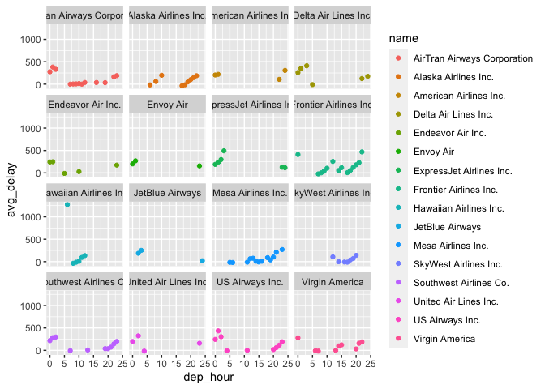
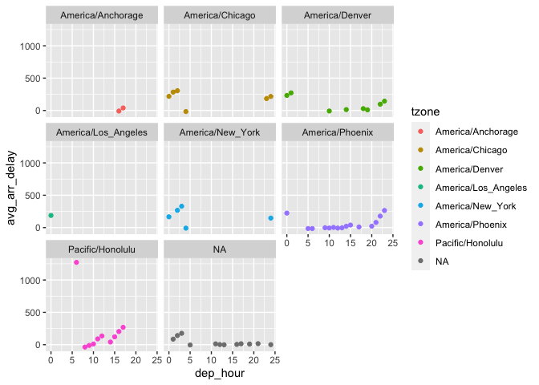
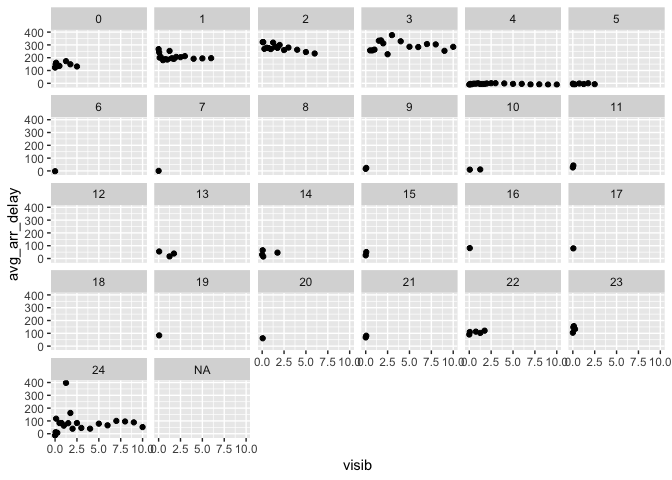

433 hw–week4
================
Ruohe Zhou

Due October 5th, by midnight: In r4ds flights… What time of day should
you fly if you want to avoid delays as much as possible? Does this
choice depend on anything? Season? Weather? Airport? Airline? Find three
patterns (“null results” are ok\!). Write your results into Rmarkdown.
Include a short introduction that summarizes the three results. Then,
have a section for each finding. Support each finding with data
summaries and visualizations. Include your code when necessary. This
shouldn’t be long, but it might take some time to find the things you
want to talk about and lay them out in an orderly way.

``` r
library(nycflights13)
```

    ## Warning: package 'nycflights13' was built under R version 4.0.2

``` r
library(ggplot2)
```

    ## Warning: package 'ggplot2' was built under R version 4.0.2

``` r
head(flights)
```

    ## # A tibble: 6 x 19
    ##    year month   day dep_time sched_dep_time dep_delay arr_time sched_arr_time
    ##   <int> <int> <int>    <int>          <int>     <dbl>    <int>          <int>
    ## 1  2013     1     1      517            515         2      830            819
    ## 2  2013     1     1      533            529         4      850            830
    ## 3  2013     1     1      542            540         2      923            850
    ## 4  2013     1     1      544            545        -1     1004           1022
    ## 5  2013     1     1      554            600        -6      812            837
    ## 6  2013     1     1      554            558        -4      740            728
    ## # … with 11 more variables: arr_delay <dbl>, carrier <chr>, flight <int>,
    ## #   tailnum <chr>, origin <chr>, dest <chr>, air_time <dbl>, distance <dbl>,
    ## #   hour <dbl>, minute <dbl>, time_hour <dttm>

``` r
library(dplyr)
```

    ## Warning: package 'dplyr' was built under R version 4.0.2

    ## 
    ## Attaching package: 'dplyr'

    ## The following objects are masked from 'package:stats':
    ## 
    ##     filter, lag

    ## The following objects are masked from 'package:base':
    ## 
    ##     intersect, setdiff, setequal, union

``` r
library(lubridate)
```

    ## Warning: package 'lubridate' was built under R version 4.0.2

    ## 
    ## Attaching package: 'lubridate'

    ## The following objects are masked from 'package:base':
    ## 
    ##     date, intersect, setdiff, union

\#\#introduction

The three results I found are: (1) Most airline companies tend to delay
the arrival time of their flights during 00:00 to 03:00 and 20:00 to
23:00 (2) Except in Pacific/Honolulu, plane delay usually happen during
00:00 to 03:00. (3) plane delay tend to happen when the visibility is
low, but during 00:00 to 03:00, the delay rate is quite high no matter
what visibility is.

\#\#delay hours and airline company

``` r
fli <- flights%>%
  select(arr_delay, carrier, dep_time, dest, origin, year, month, day) %>%
  mutate(dep_hour = dep_time %/% 100,
            dep_minu = dep_time %% 100)

fli_airline <- fli %>% left_join(airlines, by = 'carrier')
```

``` r
fli_airline_delay <- fli_airline %>% group_by(name, dep_hour) %>%
  summarize(avg_delay = mean(arr_delay))
```

    ## `summarise()` has grouped output by 'name'. You can override using the `.groups` argument.

``` r
sig_delay_airline <- fli_airline_delay %>% filter(avg_delay > mean(fli_airline_delay$avg_delay, na.rm = TRUE))
sig_delay_airline
```

    ## # A tibble: 52 x 3
    ## # Groups:   name [16]
    ##    name                        dep_hour avg_delay
    ##    <chr>                          <dbl>     <dbl>
    ##  1 AirTran Airways Corporation        0      277.
    ##  2 AirTran Airways Corporation        1      382.
    ##  3 AirTran Airways Corporation        2      331 
    ##  4 AirTran Airways Corporation       22      164.
    ##  5 AirTran Airways Corporation       23      190.
    ##  6 Alaska Airlines Inc.              10      198 
    ##  7 Alaska Airlines Inc.              21      147.
    ##  8 Alaska Airlines Inc.              22      188 
    ##  9 American Airlines Inc.             0      205.
    ## 10 American Airlines Inc.             1      219 
    ## # … with 42 more rows

``` r
head(fli_airline_delay) 
```

    ## # A tibble: 6 x 3
    ## # Groups:   name [1]
    ##   name                        dep_hour avg_delay
    ##   <chr>                          <dbl>     <dbl>
    ## 1 AirTran Airways Corporation        0    277.  
    ## 2 AirTran Airways Corporation        1    382.  
    ## 3 AirTran Airways Corporation        2    331   
    ## 4 AirTran Airways Corporation        5     NA   
    ## 5 AirTran Airways Corporation        6     NA   
    ## 6 AirTran Airways Corporation        7     -0.16

``` r
ggplot(fli_airline_delay, aes(x = dep_hour, y = avg_delay, color = name)) + geom_point() + facet_wrap(~name)
```

    ## Warning: Removed 191 rows containing missing values (geom_point).

<!-- -->

Except for Hawaiian Airline and Frontier Airline, most airline companies
only have delay at time 20:00 to 03:00.

\#\#delay hours and airport
timezone

``` r
fli_airport <- fli %>% left_join(airports, by = c('dest' = 'faa')) %>% group_by(dep_hour, tzone) %>% summarize(avg_arr_delay = mean(arr_delay)) 
```

    ## `summarise()` has grouped output by 'dep_hour'. You can override using the `.groups` argument.

``` r
head(fli_airport)
```

    ## # A tibble: 6 x 3
    ## # Groups:   dep_hour [1]
    ##   dep_hour tzone               avg_arr_delay
    ##      <dbl> <chr>                       <dbl>
    ## 1        0 America/Chicago              219.
    ## 2        0 America/Denver               233 
    ## 3        0 America/Los_Angeles          188.
    ## 4        0 America/New_York             166.
    ## 5        0 America/Phoenix              224 
    ## 6        0 <NA>                          NA

``` r
sig_delay_airport <- fli_airport %>% filter(avg_arr_delay > mean(fli_airport$avg_arr_delay, na.rm = TRUE))
sig_delay_airport 
```

    ## # A tibble: 23 x 3
    ## # Groups:   dep_hour [12]
    ##    dep_hour tzone               avg_arr_delay
    ##       <dbl> <chr>                       <dbl>
    ##  1        0 America/Chicago              219.
    ##  2        0 America/Denver               233 
    ##  3        0 America/Los_Angeles          188.
    ##  4        0 America/New_York             166.
    ##  5        0 America/Phoenix              224 
    ##  6        1 America/Chicago              284.
    ##  7        1 America/Denver               272.
    ##  8        2 America/Chicago              306.
    ##  9        2 America/New_York             267.
    ## 10        2 <NA>                         141.
    ## # … with 13 more rows

``` r
ggplot(fli_airport, aes(x = dep_hour, y = avg_arr_delay, color = tzone)) + geom_point() + facet_wrap(~tzone)
```

    ## Warning: Removed 97 rows containing missing values (geom_point).

<!-- -->

\#\#delay hours and weather

``` r
weathers<- weather %>% mutate(date = make_date(year, month, day)) 
flight1 <- fli%>% mutate(date= make_date(year, month, day))
fli_weather<-flight1 %>% left_join(weathers, by = 'date') %>% group_by(visib, dep_hour) %>% summarize(avg_arr_delay = mean(arr_delay))
```

    ## `summarise()` has grouped output by 'visib'. You can override using the `.groups` argument.

``` r
head(fli_weather)
```

    ## # A tibble: 6 x 3
    ## # Groups:   visib [1]
    ##   visib dep_hour avg_arr_delay
    ##   <dbl>    <dbl>         <dbl>
    ## 1     0        0       123.   
    ## 2     0        1       267    
    ## 3     0        4        -9.8  
    ## 4     0        5        -2.44 
    ## 5     0        6        -2.18 
    ## 6     0        7         0.376

``` r
sig_delay_visib <- fli_weather %>% filter(avg_arr_delay > mean(fli_weather$avg_arr_delay, na.rm = TRUE))
sig_delay_visib
```

    ## # A tibble: 63 x 3
    ## # Groups:   visib [20]
    ##    visib dep_hour avg_arr_delay
    ##    <dbl>    <dbl>         <dbl>
    ##  1  0           0          123.
    ##  2  0           1          267 
    ##  3  0.06        0          147.
    ##  4  0.06        1          242.
    ##  5  0.06        2          322 
    ##  6  0.06       22          110.
    ##  7  0.06       23          147.
    ##  8  0.12        0          161.
    ##  9  0.12        1          201.
    ## 10  0.12        2          322 
    ## # … with 53 more rows

``` r
ggplot(fli_weather, aes(x = visib, y = avg_arr_delay)) + geom_point() + facet_wrap(~dep_hour)
```

    ## Warning: Removed 403 rows containing missing values (geom_point).

<!-- -->
